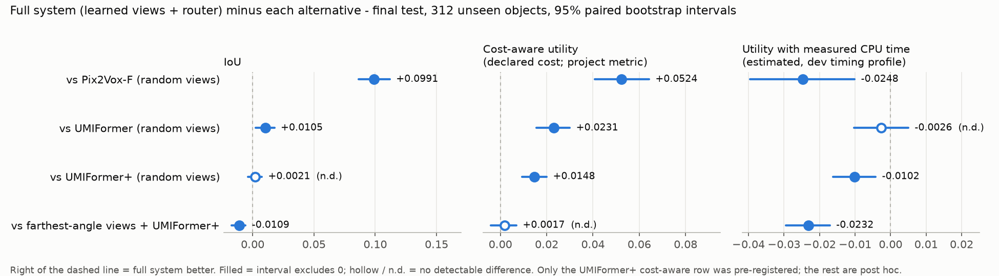

# Benchmark: the full system against standard reconstruction

This document states what was measured, how, what the results are, and how to
check them yourself. Every number below is generated from files committed in
`artifacts/final/`, and `verify_benchmark.py` re-derives them.



## The question

Does choosing **which views to take** (a learned policy) and **which pretrained
reconstructor to run** (a learned router) do better than using a reconstructor
the standard way -- five random views, one fixed model?

## Setup

| | |
|---|---|
| **Data** | ShapeNet renderings and 32^3 voxels (Choy et al. 2016): 13 categories, 24 views per object |
| **Reconstructors** | Pix2Vox-F, UMIFormer, UMIFormer+ -- released checkpoints, frozen, never retrained |
| **Budget** | 5 views per object: 1 given start view + 4 chosen |
| **Test set** | `final_test`: 312 objects (24 per category) none of the reconstructors were trained on, never used for training, model selection or development, evaluated once ([`build/rl_pipeline/configs/splits_v1.json`](build/rl_pipeline/configs/splits_v1.json)) |
| **"Used normally"** | 5 random views, one fixed reconstructor -- the evaluation protocol of the Pix2Vox and UMIFormer papers; 24 random view sets per object |
| **Full system** | learned view policy (PPO, pose-conditioned) + learned router (category from images, per-category backbone table, per-object ridge correction) |

**Metrics**

* **IoU** -- voxel IoU at a frozen threshold per reconstructor (0.4).
* **Cost-aware utility** (the project's objective): `IoU - 0.0771 x cost`,
  with cost = CPU seconds per 5-view prediction declared before the study
  (Pix2Vox-F 0.51, UMIFormer 1.28, UMIFormer+ 1.28). Backbone compute only.
* **CPU-adjusted utility (estimated)**: the same, but charging the *measured*
  CPU time of the backbone actually run plus the controller (view policy,
  ResNet-50 features, router), from a benchmark on 26 objects
  (`artifacts/phase3/latency_cpu.json`). Conditional on that machine's
  timing profile.

**Statistics**: object-level paired bootstrap (2,000 replicates, seed 0), every
system compared on the same objects with the same resampling weights;
episodes averaged within objects; timing uncertainty resampled independently
(the timing cohort is disjoint from the test objects). 95% percentile
intervals.

## Results (final test, 312 unseen objects)

| system | views | reconstructor | IoU | cost-aware utility | CPU-adjusted utility (est.) | CPU s / object (est.) | GPU s / object (est.) |
|---|---|---|---|---|---|---|---|
| Pix2Vox-F, used normally | 5 random | pix2vox_f | 0.6778 | 0.6385 | 0.6258 | 0.675 | 0.044 |
| UMIFormer, used normally | 5 random | umiformer | 0.7665 | 0.6678 | 0.6036 | 2.113 | 0.190 |
| UMIFormer+, used normally | 5 random | umiformer_plus | 0.7748 | 0.6761 | 0.6112 | 2.122 | 0.192 |
| farthest-angle views + UMIFormer+ | farthest-angle | umiformer_plus | 0.7878 | 0.6892 | 0.6242 | 2.123 | 0.193 |
| **full system** (learned views + learned router) | learned policy | learned router | 0.7769 | 0.6909 | 0.6010 | 2.282 | 0.218 |
| *reference: oracle backbone on the policy's views* | learned policy | best per view set | 0.7944 | 0.7171 | - | - | - |

**Paired differences, full system minus each alternative:**

| full system minus | IoU | cost-aware utility | CPU-adjusted utility (est.) | status |
|---|---|---|---|---|
| Pix2Vox-F, used normally | **+0.0991** [+0.0865, +0.1118] | **+0.0524** [+0.0407, +0.0642] | -0.0248 [-0.0395, -0.0101] | post hoc |
| UMIFormer, used normally | **+0.0105** [+0.0024, +0.0177] | **+0.0231** [+0.0155, +0.0300] | -0.0026 [-0.0103, +0.0050] | post hoc |
| UMIFormer+, used normally | +0.0021 [-0.0040, +0.0074] | **+0.0148** [+0.0093, +0.0200] | -0.0102 [-0.0162, -0.0042] | **primary, pre-registered** (cost-aware) |
| farthest-angle views + UMIFormer+ | -0.0109 [-0.0171, -0.0058] | +0.0017 [-0.0041, +0.0069] | -0.0232 [-0.0294, -0.0171] | post hoc (cost-aware: a registered secondary) |

### What the results support

* **The pre-registered claim holds.** The full system has higher cost-aware
  utility than UMIFormer+ used normally, the strongest standard baseline:
  +0.0148 [+0.0093, +0.0200].
* **Against each standard reconstructor, the full system has higher
  cost-aware utility**, and **higher IoU than Pix2Vox-F and UMIFormer**.
  Against UMIFormer+ the IoU difference is not detectable: the gain there is
  cost, from routing about 21% of objects to the cheaper Pix2Vox-F.

### What they do not support

* **A simple baseline does as well on the project's metric.** Farthest-angle
  views (spread the five views as far apart as possible) with UMIFormer+
  show no statistically detectable difference in cost-aware utility (+0.0017
  [-0.0041, +0.0069] -- this is not equivalence; the interval admits
  meaningful differences either way) and *higher* IoU than the full system
  (0.7878 vs 0.7769).
* **The learned policy's view-selection advantage over farthest-angle
  selection, seen in development, was not reproduced** on the final test
  (policy - heuristic with the corrected router: -0.0018 [-0.0052, +0.0014]).
* **Charging measured controller time, the full system is not better.** On
  the measured CPU profile it trails every standard reconstructor except
  UMIFormer (not detectable there). ResNet-50 features cost ~0.4 s per object
  on that CPU. This is conditional on the timing profile:

  | CPU-adjusted contrast | measured pipeline totals | machine 0.75x | machine 1.25x |
  |---|---|---|---|
  | full system - UMIFormer+ used normally | -0.0045 [-0.0234, +0.0157] | -0.0071 [-0.0127, -0.0016] | -0.0133 [-0.0197, -0.0065] |
  | farthest-angle + UMIFormer+ - full system | +0.0240 [+0.0032, +0.0447] | +0.0201 [+0.0146, +0.0260] | +0.0263 [+0.0194, +0.0328] |

* **The router's per-object correction**: its development utility gain did not
  replicate (policy views: -0.0015 [-0.0062, +0.0022] vs the plain router); it
  never improved IoU, only shifted choices toward the cheaper backbone.

## How this was protected against fooling ourselves

1. **Clean splits.** All three reconstructors were trained on ShapeNet's
   official *train* split and score 0.08-0.10 IoU higher there, so the
   controller was trained and selected on objects from the official *test*
   split, carved into `controller_train` (8,052), `dev` (309) and `final_test`
   (312), with objects listed under two categories excluded everywhere.
2. **Pre-registration before any final data existed.**
   [`artifacts/final/preregistration.json`](artifacts/final/preregistration.json)
   fixed the primary and secondary comparisons, the metrics reported whatever
   the outcome, the sampling seed, the statistics, and the SHA-256 of every
   artifact (split manifest, policy, router, timing profiles, reconstructor
   checkpoints). A dated
   [amendment](artifacts/final/preregistration_amendment_1.json), also before
   any final data, changed only the code build (enforcement and atomic writes).
3. **Enforced, single evaluation.** The final evaluator refuses to print
   anything unless every registered hash and setting matches. The final test
   was collected without computing any aggregate result, and evaluated once
   (`artifacts/final/eval_final.json`). The comparisons against Pix2Vox-F,
   UMIFormer and the heuristic's IoU were computed afterwards and are labelled
   post hoc (`artifacts/final/standard_benchmark.json`); the selected system
   was not changed after seeing them.

## Verify it

```bash
# 1. integrity + 2. order -- needs only Python and git
python verify_benchmark.py

# 3. full recomputation -- needs the archive of the artifacts too large for git
#    (final-test features, utility cache, selected policy; see ARTIFACTS.md)
#    and the packages in build/rl_pipeline/requirements.txt
python verify_benchmark.py --archive final_artifacts_archive.zip
```

What it checks:

1. **Integrity**: every git-tracked artifact matches the SHA-256 recorded in
   the pre-registration, its amendment, or the collection's completion marker.
2. **Order**, from git history:

   | event | commit | time |
   |---|---|---|
   | pre-registration | `c03de9a` | 2026-10-03 00:23 +0530 |
   | amendment 1 | `1385ea0` | 2026-10-03 00:32 +0530 |
   | final collection (views + completion marker) | `e98244a` | 2026-10-03 07:40 +0530 |
   | pre-registered results | `053e390` | 2026-10-03 07:41 +0530 |
   | post hoc benchmark | `42bad82` | 2026-10-03 08:39 +0530 |

3. **Recomputation**: the archive matches its `SHA256SUMS`; its features are
   the ones the completion marker binds and its policy is the registered one;
   the enforced evaluation and the post hoc benchmark are re-run from scratch
   and every number is compared with the committed results.

Last run: **all checks passed**, every recomputed number equal to the committed
results. Registration identity recorded in the results:
`preregistration.json` sha256 `06e1b012...`, amendment `5135e022...`.

## Limitations

* One training run of the policy; claims about training in general would need
  independent seeds.
* Five views only. Variable-budget acquisition (stopping early) is untested.
* CPU-adjusted results depend on one machine's timing profile; the
  sensitivity table shows which conclusions survive a 0.75x-1.25x speed change.
* Thirteen ShapeNet categories, synthetic renderings, 32^3 voxels.

Development results, every intermediate finding and the full decision record
are in [`HANDOFF.md`](HANDOFF.md).
