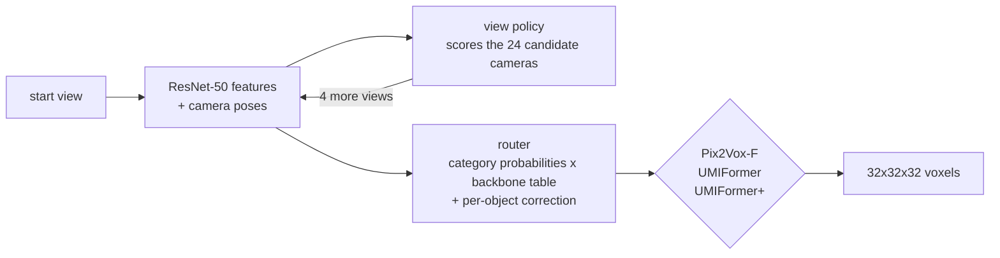

# Active view selection and reconstructor routing for 3D reconstruction

A system that, for each object, decides **which camera views to take** and
**which pretrained reconstructor to run on them**, trading reconstruction
quality against compute. A reinforcement-learning policy picks the views; a
learned router picks among Pix2Vox-F, UMIFormer and UMIFormer+.

It was evaluated once, on 312 held-out ShapeNet objects, under a
pre-registered protocol with hash-enforced inputs. The benchmark below can be
re-derived from this repository with one command.


## Results

On 312 unseen objects, against each reconstructor used the standard way (five
random views, one fixed model):

| full system minus | IoU | cost-aware utility |
|---|---|---|
| Pix2Vox-F | **+0.099** [+0.087, +0.112] | **+0.052** [+0.041, +0.064] |
| UMIFormer | **+0.011** [+0.002, +0.018] | **+0.023** [+0.016, +0.030] |
| UMIFormer+ | +0.002 [-0.004, +0.007] | **+0.015** [+0.009, +0.020] (pre-registered) |

95% paired bootstrap intervals; bold = interval excludes zero. Cost-aware
utility is `IoU - 0.0771 x backbone CPU-seconds`, the project's objective.

**In short:** the system beats every standard reconstructor on quality per
unit of compute, and on accuracy against Pix2Vox-F and UMIFormer; against
UMIFormer+ the gain is compute, not accuracy.

**Read these too** -- they are part of the result:

* A simple baseline -- *spread the five views as far apart as possible, then
  always run UMIFormer+* -- shows **no statistically detectable difference**
  in cost-aware utility from the full system and has slightly *higher* IoU.
  The learned policy's development edge over that heuristic did not reproduce
  on the final test.
* Charging the controller's **measured CPU time** (ResNet-50 features, ~0.4 s
  per object on the test machine), the full system no longer beats the
  standard reconstructors. On a T4 GPU the controller itself takes ~0.06 s per
  object.

Full tables, the protocol, the CPU-timing sensitivity analysis and the
limitations: **[BENCHMARK.md](BENCHMARK.md)**.

## How it works



* **View policy** (`build/rl_pipeline/policy/pose_policy.py`): PPO
  actor-critic over the views acquired so far. It scores candidates by their
  camera pose, not by index -- the view index points in a different direction
  on every ShapeNet object, which is why an index-based policy learns nothing.
  Trained against the best achievable utility over the three reconstructors.
* **Router** (`build/rl_pipeline/train_router.py`): predicts the category from
  the acquired views (89.8% accurate), looks up a per-category backbone table
  learned from objects no reconstructor was trained on, and applies a
  regularised per-object correction.
* **Reconstructors**: released checkpoints, frozen. Only the chosen one runs.

Things that mattered, all documented in [HANDOFF.md](HANDOFF.md): the
reconstructors were trained on ShapeNet's official train split and score
0.08-0.10 IoU higher on it, so the controller is trained and evaluated only
on official *test*-split objects, split three ways; routing labels for every
view set are cached with their provenance and merged, never overwritten.

## Verify the benchmark

```bash
python verify_benchmark.py
```

checks, from this checkout alone, that every committed artifact matches the
SHA-256 in the pre-registration and that git history shows pre-registration ->
final collection -> results. With the archive of the files too large for git
(see [ARTIFACTS.md](ARTIFACTS.md)) it also re-runs the whole final evaluation
and compares every number:

```bash
pip install -r build/rl_pipeline/requirements.txt
python verify_benchmark.py --archive final_artifacts_archive.zip
```

## Run it on an object

```bash
python build/rl_pipeline/infer_rgb.py \
    --object-dir <ShapeNetRendering>/<synset>/<model_id> \
    --policy artifacts/tier1/set_pose_s164864.pt \
    --router artifacts/router/router.npz \
    --out recon.npy
```

Images and camera poses in, a 32^3 occupancy grid out; ground truth is read only
if you pass `--gt` to score the result. The policy checkpoint is in the archive
(ARTIFACTS.md).

## Reproduce from scratch

GPU steps ran as Kaggle notebooks; each is one cell in `build/kaggle_*_cell.py`,
in order Phase 1 (policy training, ~9 h) -> Phase 1b (checkpoint comparison,
router features) -> Phase 3 (heuristic view sets, latency) -> final collection.
See [KAGGLE_STEPS.md](KAGGLE_STEPS.md). The rest runs on a CPU:
`train_router.py`, `score_routed.py`, `phase3_views.py`, `phase3_eval.py`,
`plot_benchmark.py`.

**Data**: ShapeNet renderings and voxels from Choy et al. 2016
(`http://cvgl.stanford.edu/data2/ShapeNetRendering.tgz`,
`http://cvgl.stanford.edu/data2/ShapeNetVox32.tgz`), addressed through the
Pix2Vox taxonomy in `build/rl_pipeline/datasets/ShapeNet.json`.

**Reconstructor weights**: Pix2Vox-F from the
[Pix2Vox](https://github.com/hzxie/Pix2Vox) release; UMIFormer and UMIFormer+
from the [UMIFormer](https://github.com/GaryZhu1996/UMIFormer) release. Their
SHA-256 are recorded in the pre-registration.

## Repository layout

```
build/rl_pipeline/
  policy/pose_policy.py      view policy (pose-conditioned actor-critic)
  env/rgb_view_env.py        view-acquisition environment
  training/                  PPO trainer, rollout buffer, utility envelope + cache
  backbones/                 Pix2Vox-F, UMIFormer, UMIFormer+ wrappers
  run_0b.py                  policy training           eval_0b.py      paired checkpoint eval
  train_router.py            router                    score_routed.py checkpoint selection
  phase3_views.py            frozen evaluation views   phase3_eval.py  evaluation matrix
  bench_latency.py           CPU/GPU latency           final_collect.py final-test collection
  infer_rgb.py               inference on one object   splits.py       controller splits
  configs/                   frozen splits, pose normalisation
build/kaggle_*_cell.py       the Kaggle jobs           build/package_for_kaggle.py
artifacts/                   every result: tier0b, tier1, router, phase3, final
verify_benchmark.py          re-derive and check the benchmark
```

`train.py`, `view_policy.py`, `view_recon_env.py` and `dataloader.py` in
`build/rl_pipeline/` belong to the earlier RGB-D pipeline, kept for history
([EXPERIMENTS.md](EXPERIMENTS.md)).

## Limitations

One policy training run (no seed replication); five views only (stopping early
is untested); CPU-adjusted conclusions depend on one machine's timing profile;
13 ShapeNet categories of synthetic renderings at 32^3. Details in
[BENCHMARK.md](BENCHMARK.md).

## Third-party code and data

`build/rl_pipeline/backbones/_vendor/umiformer/` adapts code from
[UMIFormer](https://github.com/GaryZhu1996/UMIFormer), and the Pix2Vox-F
wrapper reproduces the architecture of
[Pix2Vox](https://github.com/hzxie/Pix2Vox); their licenses apply to that
code. ShapeNet is subject to its own terms of use.
